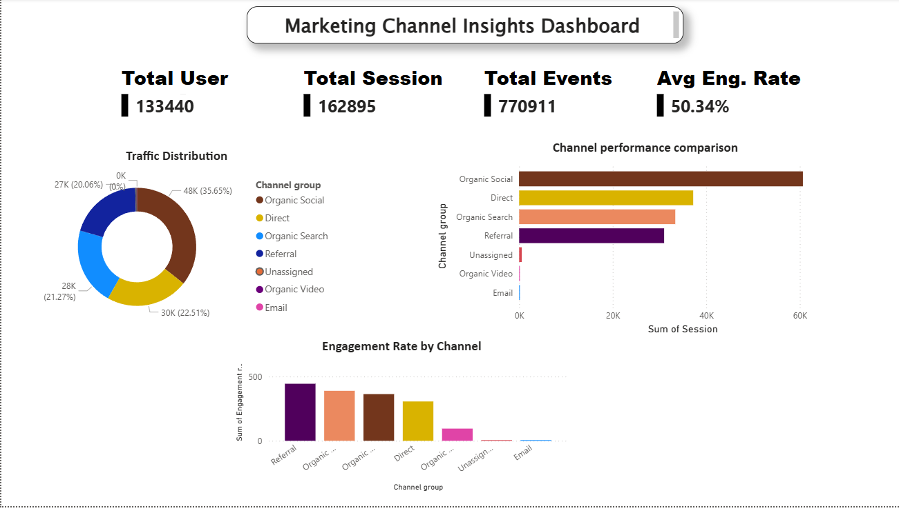
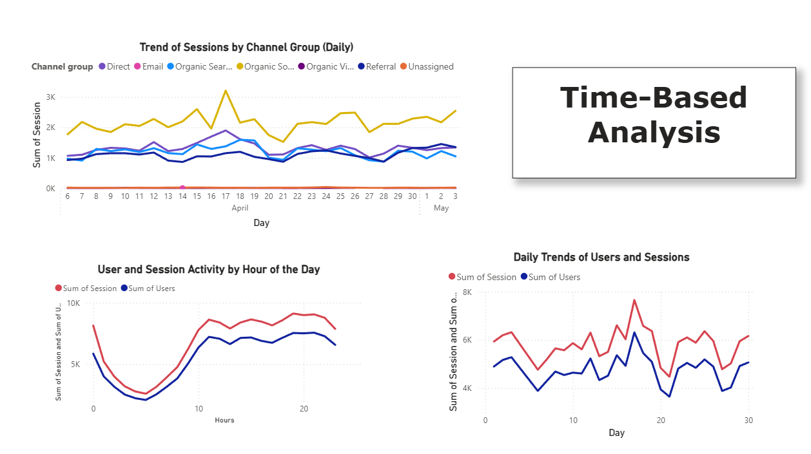
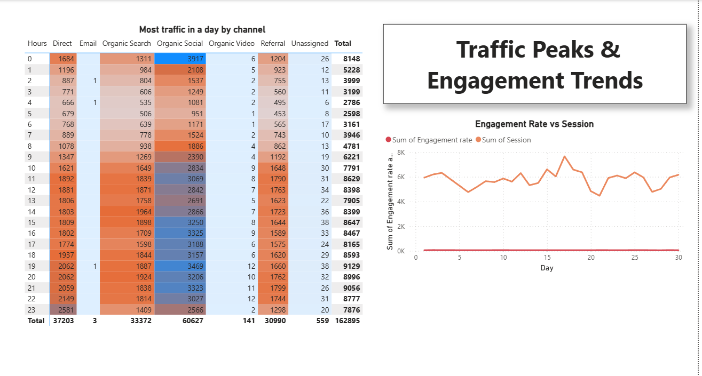

# Website Analytics Dashboard Project 📊

A comprehensive website analytics project that combines Python data analysis with interactive Power BI visualizations to derive actionable insights from marketing channel performance and user behavior.

## 🎯 Project Overview

This project analyzes website traffic data to understand user behavior, marketing channel effectiveness, and engagement patterns. The analysis pipeline includes data cleaning, transformation, exploratory data analysis (EDA), and interactive dashboard creation.

## 📸 Dashboard Screenshots

### Marketing Channel Insights Dashboard

*Overview of key metrics including total users, sessions, events, and channel performance comparison*

### Time-Based Analysis

*Daily trends and hourly activity patterns for user sessions across different channels*

### Traffic Peaks & Engagement Trends

*Detailed hourly traffic distribution and engagement rate analysis*

## 🔧 Technologies Used

### Python Libraries
- **pandas** - Data manipulation and transformation
- **numpy** - Numerical computations and array operations
- **seaborn** - Statistical data visualization
- **matplotlib** - Plotting and data visualization

### Visualization Tool
- **Power BI** - Interactive dashboard creation and business intelligence

## 📊 Key Metrics Analyzed

- **Total Users**: 133,440
- **Total Sessions**: 162,895
- **Total Events**: 770,911
- **Average Engagement Rate**: 50.34%

## 🔍 Analysis Components

### 1. Data Cleaning & Transformation
- Handled missing values and inconsistencies
- Standardized data formats and types
- Removed duplicates and outliers
- Created derived metrics for analysis

### 2. Exploratory Data Analysis (EDA)
- Traffic distribution across marketing channels
- Temporal patterns (daily and hourly trends)
- Channel performance comparison
- Engagement rate analysis

### 3. Key Findings

#### Channel Performance
- **Organic Social**: Leading channel with ~60K sessions (35.65%)
- **Direct Traffic**: Second highest with ~30K sessions (22.51%)
- **Organic Search**: Strong performer with ~28K sessions (21.27%)
- **Referral**: Consistent traffic with ~27K sessions (20.06%)

#### Engagement Insights
- Referral channel shows highest engagement rates
- Organic Search and Organic Social maintain strong engagement
- Peak traffic hours: 8 AM - 11 PM
- Lowest activity: 2 AM - 6 AM

#### Temporal Patterns
- Consistent daily traffic with occasional spikes
- Notable spike on April 17th (~3K sessions)
- Steady growth trend from late April to early May

## 📈 Dashboard Features

### Marketing Channel Insights
- Real-time KPI tracking (Users, Sessions, Events)
- Traffic distribution visualization
- Channel performance comparison
- Engagement rate analysis by channel

### Time-Based Analysis
- Daily session trends by channel
- Hourly activity patterns
- User and session correlations

### Traffic Peaks & Engagement
- Hourly heatmap of traffic by channel
- Engagement rate trends over time
- Peak traffic identification

## 💡 Key Insights & Recommendations

1. **Optimize Social Media Strategy**: With Organic Social being the top performer (35.65%), continue investing in social media marketing

2. **Peak Hour Targeting**: Focus campaigns during 8 AM - 11 PM when engagement is highest

3. **Referral Program**: High engagement rates from referral traffic suggest potential for referral program expansion

4. **Direct Traffic Conversion**: Improve direct traffic engagement through better landing page optimization

5. **Search Optimization**: Maintain SEO efforts as organic search contributes 21.27% of total traffic

## 🤝 Contributing

Contributions are welcome! Please feel free to submit a Pull Request.

## 📝 License

This project is licensed under the MIT License - see the LICENSE file for details.

## 👨‍💻 Author

Prathamesh Upreti
- GitHub: https://github.com/PrathameshUpreti
- LinkedIn: https://www.linkedin.com/in/prathamesh-upreti-601b81296 

## 🙏 Acknowledgments

- Data source: https://www.youtube.com/@theiScale
- Inspiration from various web analytics best practices
- Power BI community for dashboard design insights

---

**Note**: This project is for educational and portfolio purposes. Ensure you have proper authorization before analyzing any real website data.
